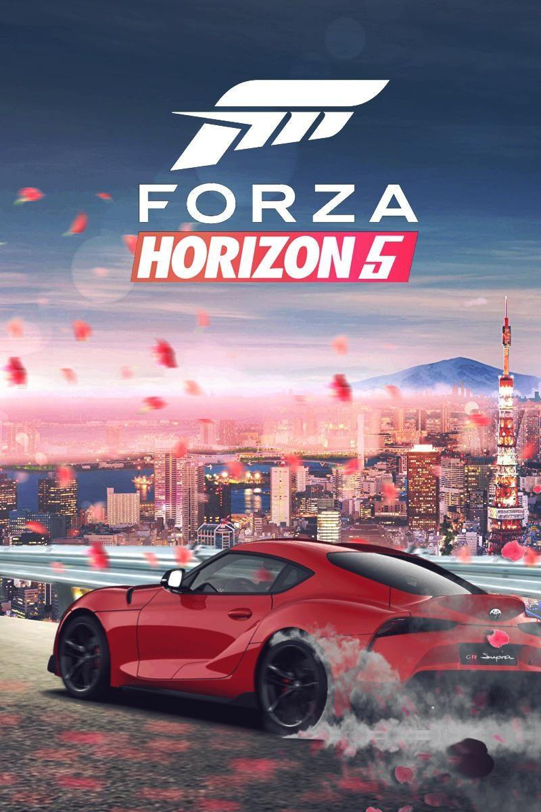

# GameCritic

GameCritic is a static, dark-themed front-end demo for a gaming reviews and discovery platform. It demonstrates modern UI patterns (animated stats, responsive grids, and a continuous partners marquee) built with plain HTML, CSS and vanilla JavaScript.

This repository is intended as a lightweight starting point for a static marketing or prototype page for a gaming site.

---

## Key Features

- Animated hero statistics (supports K/M formatting and suffixes).
- Responsive trending games grid with progressive enhancement for imagery.
- Partners / Sponsors marquee with continuous scroll and light "plate" fallback for dark logos.
- ESRB text badge fallback when a logo is unavailable.
- Mobile-first responsive layout and keyboard accessibility improvements (skip-link, focus states).

---

## Repo Structure

- `index.html` — main static page and markup.
- `style.css` — single stylesheet with responsive layout and variables.
- `assets/images/` — image assets (game art, logos, favicon).
- `LICENSE` — MIT license.

---

## Quick start

No build step is required. To preview locally:

1. Clone the repo or download the ZIP.
2. Open `index.html` in a modern browser.

For a simple local server (recommended to avoid CORS issues with images):

```powershell
python -m http.server 8000
# then visit http://localhost:8000
```

---

## Development

Recommended workflow:

1. Create a feature branch for your change.
2. Edit `index.html` and/or `style.css`.
3. Test in multiple screen sizes and perform keyboard navigation checks.
4. Commit and open a pull request.

Helpful tools:
- Browser DevTools (responsive mode and accessibility audits)
- Image optimizers (Squoosh, imagemin)
- Linters (stylelint for CSS, html-validate)

---

## Accessibility & Best Practices

- Uses semantic HTML5 elements: `header`, `nav`, `main`, `section`, `footer`.
- A keyboard-accessible skip link is included to jump to main content.
- Images include `alt` attributes and the marquee is marked decorative via `aria-hidden="true"`.
- Consider running automated accessibility checks (axe, Lighthouse) if you change colors or layout.

---

## Assets & Images

- Store custom images in `assets/images/` and reference them from `index.html`.
- Use lowercase, hyphen-separated filenames (e.g., `nvidia-logo.png`).
- For better performance, generate WebP versions and use `<picture>` to provide fallbacks. Example:

```html
<picture>
	<source srcset="assets/images/forza-horizon.webp" type="image/webp">
	
</picture>
```

---

## Performance Recommendations

- Convert large images to WebP and compress them (60–80% quality for posters is a good target).
- Self-host or subset fonts to reduce third-party requests.
- Introduce a light build step (PostCSS) to autoprefix and minify CSS for production.

---

## CI & Deployment Suggestions

- Add a GitHub Action to run `html-validate` and `stylelint` on pull requests.
- Add an optional image optimization Action to auto-generate WebP assets on push.
- Deploy the `main` branch to GitHub Pages, Netlify, or Vercel for static hosting.

Example GitHub Pages push:

```powershell
git remote add origin <your-repo-url>
git push -u origin main
```

---

## Known Limitations

- Logo plate detection uses canvas sampling and may be blocked for cross-origin images (CORS). Use explicit plate classes where necessary.
- No automated tests or CI are included by default; adding simple HTML/CSS linters to CI is recommended.

---

## Contributing

Contributions are welcome. Please:

1. Fork the repo.
2. Create a feature branch.
3. Open a PR with a clear description.

Follow the existing naming and asset guidelines.

---

## License

MIT — see the `LICENSE` file.

---

If you'd like, I can add a GitHub Action to run CSS/HTML linters, or generate WebP images and update `index.html` with `<picture>` fallbacks. Tell me which you'd prefer and I'll set it up.